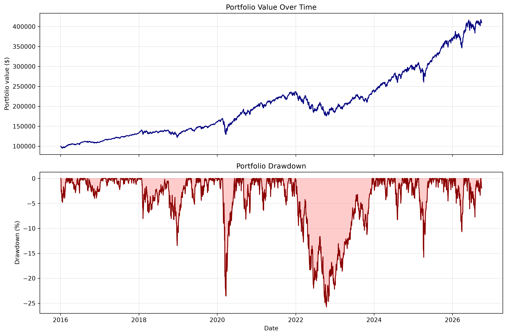
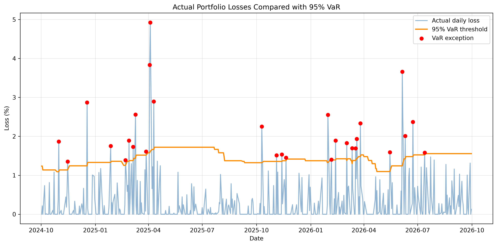
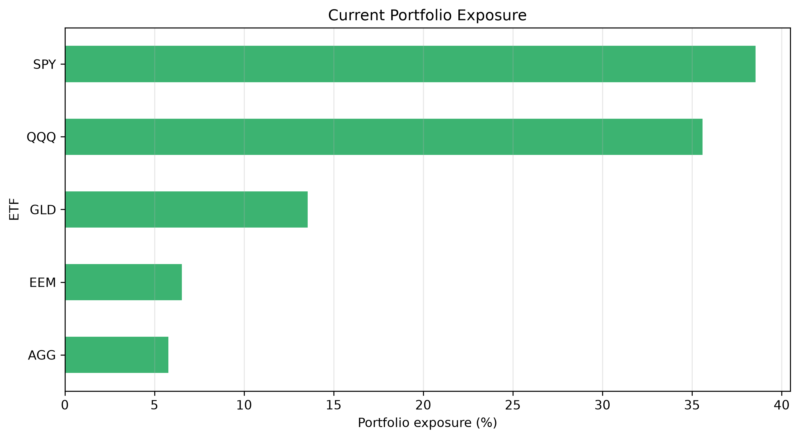
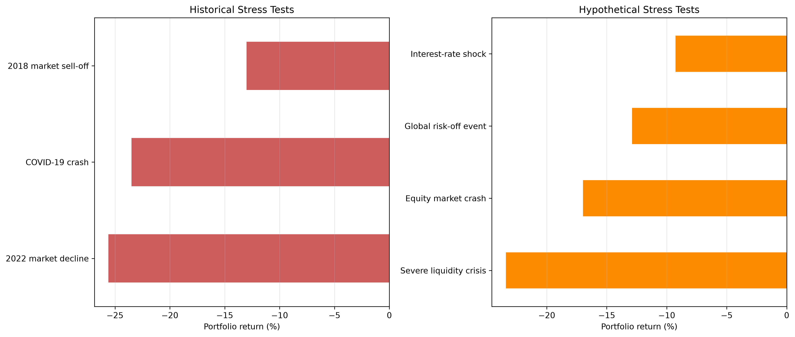

# Portfolio Market Risk and Stress Testing

A Python project for measuring and monitoring the market risk of a simulated multi-asset ETF portfolio.

The project downloads historical market data, constructs a buy-and-hold portfolio, calculates performance and risk metrics, backtests Value at Risk, and evaluates the portfolio under historical and hypothetical stress scenarios.

## Portfolio

The simulation begins with a portfolio value of **$100,000**.

| ETF | Market exposure | Initial weight |
|---|---|---:|
| SPY | Large US companies | 35% |
| QQQ | Technology-focused US companies | 20% |
| AGG | US bonds | 20% |
| GLD | Gold | 15% |
| EEM | Emerging-market equities | 10% |

The number of ETF units remains fixed throughout the simulation. As ETF prices move independently, their values and percentage exposures change over time.

## Features

- Historical ETF price download using Yahoo Finance
- Automated data-quality validation
- Daily ETF and portfolio return calculations
- Portfolio value and daily profit-and-loss tracking
- Rolling annualised volatility
- Running peak and drawdown analysis
- ETF value and percentage-exposure monitoring
- Historical Value at Risk at a 95% confidence level
- Expected Shortfall calculation
- VaR backtesting against observed portfolio losses
- Historical market stress tests
- Hypothetical multi-asset shock scenarios
- Static portfolio and risk visualisations

## Key Results

The results below were produced using the current dataset and simulated portfolio.

### Portfolio performance

- Initial portfolio value: **$100,000**
- Latest portfolio value: approximately **$409,602**
- Full-period annualised volatility: **14.57%**
- Maximum drawdown: **-25.76%**
- Maximum drawdown date: **14 October 2022**

### Value at Risk

Latest rolling estimates based on the previous 252 trading days:

- 95% one-day VaR: **1.56%**
- 95% one-day VaR amount: **$6,372**
- 95% Expected Shortfall: **2.11%**
- 95% Expected Shortfall amount: **$8,628**

A 1.56% VaR means that, based on the historical estimation window, approximately 95% of daily losses are expected to remain below 1.56%. Expected Shortfall estimates the average loss among the worst 5% of days.

### VaR backtesting

- Evaluated trading days: **2,448**
- Observed VaR exceptions: **141**
- Expected VaR exceptions: **122.4**
- Observed exception rate: **5.76%**
- Expected exception rate: **5.00%**

The observed exception rate was slightly higher than expected, indicating that the historical VaR model modestly underestimated portfolio risk.

### Historical stress tests

| Scenario | Portfolio return | Portfolio P&L | Worst daily return |
|---|---:|---:|---:|
| 2018 market sell-off | -13.01% | -$18,229 | -2.57% |
| COVID-19 crash | -23.50% | -$39,884 | -7.89% |
| 2022 market decline | -25.60% | -$60,482 | -3.83% |

The COVID-19 period produced the largest single-day shock, while the selected 2022 period produced the largest overall decline.

### Hypothetical stress tests

| Scenario | Portfolio return | Portfolio P&L | Stressed value |
|---|---:|---:|---:|
| Equity market crash | -16.98% | -$69,561 | $340,041 |
| Interest-rate shock | -9.26% | -$37,942 | $371,661 |
| Global risk-off event | -12.89% | -$52,795 | $356,808 |
| Severe liquidity crisis | -23.41% | -$95,902 | $313,700 |

The severe liquidity scenario produced the largest loss because stocks, bonds, and gold were assumed to decline simultaneously, reducing the benefits of diversification.

## Visualisations

### Portfolio performance and drawdown



### VaR backtesting



### Current portfolio exposure



### Stress-test results



## Project Structure

```text
portfolio-market-risk/
├── data/
│   ├── raw/
│   │   └── etf_prices.csv
│   └── processed/
│       ├── daily_returns.csv
│       ├── portfolio_history.csv
│       ├── risk_metrics.csv
│       ├── portfolio_exposure.csv
│       ├── var_es_metrics.csv
│       ├── var_backtest.csv
│       ├── historical_stress_tests.csv
│       └── hypothetical_stress_tests.csv
├── plots/
│   ├── portfolio_performance.png
│   ├── var_backtest.png
│   ├── current_exposure.png
│   └── stress_tests.png
├── src/
│   ├── download_data.py
│   ├── validate_data.py
│   ├── process_data.py
│   ├── build_portfolio.py
│   ├── calculate_risk_metrics.py
│   ├── calculate_exposure.py
│   ├── calculate_var_es.py
│   ├── backtest_var.py
│   ├── historical_stress_test.py
│   ├── hypothetical_stress_test.py
│   └── create_plots.py
├── tests/
│   └── test_project.py
├── .gitignore
├── pytest.ini
├── README.md
└── requirements.txt
```

## Installation

Create and activate a virtual environment:

```bash
python -m venv .venv
source .venv/Scripts/activate
```

Install the required packages:

```bash
pip install -r requirements.txt
```

## Running the Project

Run the scripts in the following order:

```bash
python src/download_data.py
python src/validate_data.py
python src/process_data.py
python src/build_portfolio.py
python src/calculate_risk_metrics.py
python src/calculate_exposure.py
python src/calculate_var_es.py
python src/backtest_var.py
python src/historical_stress_test.py
python src/hypothetical_stress_test.py
python src/create_plots.py
```

The generated datasets are saved under `data/processed`, while the visualisations are saved under `plots`.

## Automated Tests

The project includes automated tests for:

- Portfolio weights
- Initial portfolio value
- Drawdown calculation
- Expected Shortfall and VaR consistency

Run the tests with:

```bash
pytest -v
```

## Methodology

### Historical VaR

The model uses the previous 252 trading days to estimate a rolling 95% one-day VaR. Each estimate is shifted by one day so that it only uses information available before the day being evaluated.

### Expected Shortfall

Expected Shortfall is calculated as the average loss among observations that exceed the 95% VaR threshold.

### Backtesting

Each daily realised loss is compared with the VaR estimate calculated using previous data. A day is recorded as a VaR exception when the actual loss exceeds the predicted threshold.

### Stress testing

Historical stress tests measure how the simulated portfolio performed during selected periods of observed market stress.

Hypothetical stress tests apply predefined price shocks to the latest value of each ETF holding to estimate the impact on the current portfolio.

## Technologies

- Python
- pandas
- NumPy
- Matplotlib
- yfinance
- Git and GitHub

## Limitations

- The portfolio is simulated and does not represent actual investments.
- Historical VaR assumes that recent historical losses are informative about future risk.
- VaR does not represent the maximum possible loss.
- Hypothetical scenarios are assumptions rather than forecasts.
- Transaction costs, taxes, currency effects, and trading restrictions are excluded.
- The portfolio follows a fixed-unit buy-and-hold strategy and is not periodically rebalanced.
